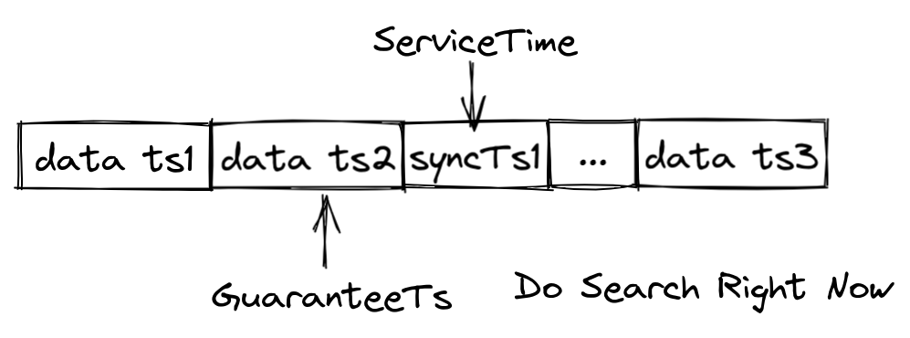
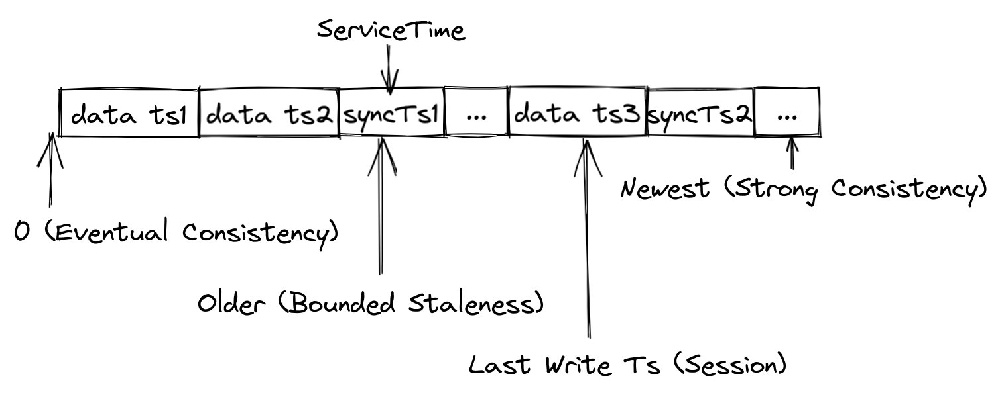

# Guarantee Timestamp in Search Requests

[English Version of This Doc](./how-guarantee-ts-works.md)

很多同学接触 Milvus 时都会对 Search 请求里面茫茫多的参数感到迷惑不解，尤其是为 Milvus 开
发 sdk 客户端的同学。这个文档就会介绍 Search 请求里面一个比较特殊的参数——“Guarantee
Timestamp”，以下简称 “GuaranteeTs”。

## Milvus 时钟机制

像大多数分布式系统一样，Milvus 会为每一条进入系统的记录分配一个时间戳。与此同时，Milvus
是一个存储计算分离的系统，数据持久化负载由 DataNodes 承担，最终会落盘到 MinIO/S3 之类的
分布式对象存储中。Search 之类的计算任务由 QueryNodes 承担，计算链路会同时处理两类数据——
批式数据以及流式数据。其中，批式数据不会再被更改，Search 请求会看到批式数据里面的所有数据。
QueryNodes 和 DataNodes 通过同一个订阅机制消费用户的插入请求，这些构成了流式数据。由于
存在网络延迟，QueryNodes 往往不会持有最新的流式数据。如果没有其他保障，在流式数据上直接做
Search 会损失许多未消费的数据，降低查询精度，这个时候 GuaranteeTs 就派上用场了。

Milvus 通过时间戳水印来保障读链路的一致性，如下图所示，在往消息队列插入数据时，
Milvus 不光会为这些插入记录打上时间戳，还会不间断地插入同步时间戳，以图中同步时间戳
syncTs1 为例，当下游消费者（比如QueryNodes）看到 syncTs1，那么意味着 syncTs1 以前的
数据已经全部被消费了，换句话说，比 syncTs1 时间戳还小的插入记录不会再出现在消息队列中。
当然了，有的话，那肯定是系统有 bug，如果你发现了，还希望尽快告诉我们。

## Guarantee Timestamp

上面说了，QueryNodes 会不断从消息队列里面拿到插入记录以及同步时间戳，每消费到一个同步时间
戳，QueryNodes 会把这个时间戳称为可服务时间——“ServiceTime”，有了上图，ServiceTime
实际上就很好理解了，意味着 QueryNodes 能够看到 ServiceTime 以前所有的数据了。

有了这个 ServiceTime，Milvus 根据不同用户对一致性以及可用性的需求，提供了 GuaranteeTs，
用户可以指定 GuaranteeTs 告知 QueryNodes 我这次 Search 请求必须看到 GuaranteeTs 以前
的所有数据。

如下图所示，如果 GuaranteeTs 小于 ServiceTime，QueryNodes 可以立刻执行 Search 查询。

如果 GuaranteeTs 大于 ServiceTime，QueryNodes 必须从消息队列里持续消费同步时间戳，
直到 ServiceTime 大于 GuaranteeTs 才能执行 Search 查询。

如果用户希望得到足够高的查询精度，对一致性有较高的要求，对查询时延不敏感，那么 GuaranteeTs
应该尽可能大；反之，如果用户希望尽快得到搜索结果，对可用性有较高的要求，对查询精度有较高的
容忍程度，那么 GuaranteeTs 可以不必特别大。

如下图所示，不同的 GuaranteeTs 分别对应四种不同的一致性：

- 强一致性：GuaranteeTs 设为系统最新时间戳，QueryNodes 需要等待 ServiceTime 推进到
当前最新时间戳才能执行该 Search 请求；
- 最终一致性：GuaranteeTs 设为 0，跳过一致性检查，立刻在当前已有数据上执行 Search 查询；
- 有界一致性：GuaranteeTs 是一个比系统最新时间稍旧的时间，在可容忍范围内可以立刻执行查询；
- 客户端一致性：客户端使用上一次写入的时间戳作为 GuaranteeTs，那么每个客户端至少能看到
自己插入的全部数据。

Milvus 默认提供强一致性，如果用户不传入 GuaranteeTs，那么会将 GuaranteeTs 设为系统
当前的最新时间戳。
